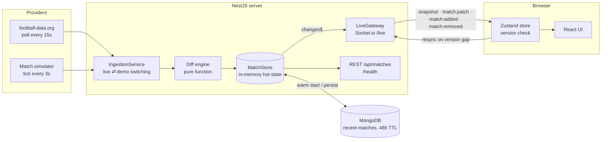

# Pitchside Live

**Real-time football scoreboard for the Premier League and La Liga.** Scores, timelines and stats update in the browser the moment they change: no refresh and no client-side polling.

> **Live demo:** _add your Vercel URL here_ · **API health:** _add your Render URL_/health

The backend watches a sports data API, **diffs every response against cached state**, and pushes **only what changed** to connected clients over WebSockets (Socket.io). When no real match is in play, a built-in simulator feeds the _same_ pipeline, so the demo is always live. The UI labels it "Demo feed".

---

## Highlights

| | |
|---|---|
| **Push, not poll** | The browser never polls. The server polls football-data.org once for everyone and fans changes out over Socket.io. |
| **Diff engine** | A pure function compares provider snapshots with cached state and emits `added` / `removed` / minimal `patch` objects. A typical patch is about 250 bytes, versus several KB for a full snapshot. |
| **Per-match versioning** | Every match has a monotonically increasing `version`. Clients apply a patch only if it is exactly `version + 1`. If one is missing, they request a **resync** of just that match. |
| **Rooms** | Clients subscribe to `league:PL`, `league:PD` or `match:<id>`, so a visitor filtering by La Liga never receives Premier League traffic. |
| **Rate-limit aware** | One request covers both leagues. The server reads football-data.org's quota headers and backs off before hitting `429`. |
| **Always-on demo** | A deterministic, seedable match simulator runs whenever nothing real is live, and switches back automatically at kick-off. Teams have strengths; matches have goals with assists, near-misses, cards, subs and VAR decisions that overturn goals live. |
| **Live league table** | The server pushes the table only when a match ends; the browser adds in-play scores on top, so every goal re-ranks the table (with ▲▼ movement) at zero extra traffic. |
| **Momentum chart** | Per-minute attack momentum, sent as *append-only deltas*: each patch carries just the new minute, not the whole array. |
| **Goal alerts** | Pop-ups for goals and VAR decisions, and a live browser tab title ("⚽ GOAL! ARS 2–1 CHE"). Driven by patches only, so reconnects never replay old goals. |
| **Resilient client** | Auto-reconnect with backoff. Stale data is dimmed while offline, and a fresh snapshot arrives on reconnect. |
| **Recent results** | The latest real matchday per league (final and half-time scores, referee), refreshed every 30 minutes and a few minutes after a live match ends, cached in MongoDB and pushed over the same socket. |
| **Socket inspector** | An in-app panel shows every message on the wire with its size, so visitors can *see* the diffs. |

## Architecture



### Socket protocol (`packages/shared/src/socket-contract.ts`)

| Direction | Event | Payload |
|---|---|---|
| client → server | `subscribe:leagues` | `{ leagues: ['PL', 'PD'] }`, replaces the league rooms and returns a `snapshot` |
| client → server | `subscribe:match` / `unsubscribe:match` | `{ matchId }`, for the detail view |
| client → server | `resync` | `{ matchIds }`, sent after a version gap is detected |
| server → client | `snapshot` | full state for a scope (`leagues` or `matches`) |
| server → client | `match:patch` | `{ matchId, version, changes, newEvents, momentumAppend? }`, changed fields only |
| server → client | `match:added` / `match:removed` | a new fixture, or one that dropped out of the feed |
| server → client | `results` | `{ leagues: [{ league, matchday, results }] }`, on connect and when results change |
| server → client | `tables` | `{ tables: [{ league, rows }] }`: demo league tables, on connect and at full time |
| server → client | `feed:mode` | `{ source: 'live' \| 'demo', reason }` |

The types and the `applyPatch()` function live in a shared package used by **both** server and client, so both sides agree on what a patch means.

## Tech stack

- **Frontend:** React 19, TypeScript, Vite, Tailwind CSS v4, Motion (Framer Motion), Zustand, React Router, socket.io-client
- **Backend:** NestJS 11, Socket.io, Mongoose
- **Database:** MongoDB (optional locally), used as a cache of recent real matches
- **Tests:** Jest (server), Vitest + Testing Library (web)

## Running locally

Requires Node 20+.

```bash
npm install
npm run dev          # builds the shared package, then runs server (:3000) and web (:5173)
```

Open http://localhost:5173. No API key or database is needed; without a token the server runs the demo feed and keeps state in memory.

To use real data and MongoDB, copy `apps/server/.env.example` to `apps/server/.env` and fill in:

| Variable | Purpose | Default |
|---|---|---|
| `FOOTBALL_DATA_TOKEN` | Free key from [football-data.org](https://www.football-data.org/client/register) | _(demo only)_ |
| `MONGO_URI` | MongoDB connection string (`docker compose up -d` gives you a local one) | _(in-memory)_ |
| `CORS_ORIGIN` | Comma-separated allowed frontend origins | `http://localhost:5173` |
| `POLL_INTERVAL_MS` | Real-feed poll interval while matches are live (min 7000) | `15000` |
| `PROBE_INTERVAL_MS` | How often to check for live matches while in demo mode | `60000` |
| `SIM_TICK_MS` | Length of one simulated match minute | `3000` |
| `RESULTS_REFRESH_MS` | How often to refresh recent results (min 300000) | `1800000` |
| `FORCE_DEMO` | `true` always uses the simulator | `false` |

The web app reads these from `apps/web/.env` (see `apps/web/.env.example`):

| Variable | Purpose |
|---|---|
| `VITE_SERVER_URL` | Backend URL (default `http://localhost:3000`) |
| `VITE_AUTHOR_NAME` | Your name, shown in the intro and footer |
| `VITE_GITHUB_URL` | Repo URL: adds GitHub links and "view code" links on the How it works page |
| `VITE_PORTFOLIO_URL` | Your portfolio or CV link, shown in the intro |
| `VITE_SITE_URL` | Deployed URL, so the link preview image uses an absolute URL |

Empty values are simply hidden. The link preview image (`apps/web/public/og-image.png`) is generated from `scripts/og-image.svg` with `npm run og-image`.

### Tests

```bash
npm test
```

- `diff-engine.spec.ts`: no-ops, field changes, event appends, added/removed, version bumps, immutability
- `live.gateway.spec.ts`: a real socket.io client against the Nest app checks snapshots, room routing, de-duplication, resync and mode broadcasts
- `match-simulator.spec.ts`: determinism by seed, and consistency (scores match goal events, possession sums to 100)
- `football-data.mapper.spec.ts`: API mapping and idempotent goal-event derivation
- `matchStore.test.ts` / `MatchRow.test.tsx`: client patch application, gap detection, and the goal highlight

## Deploying

1. **MongoDB Atlas:** create a free M0 cluster and copy the connection string.
2. **Backend on Render:** click _New → Blueprint_ and point it at this repo (uses `render.yaml`). Set `FOOTBALL_DATA_TOKEN`, `MONGO_URI` and `CORS_ORIGIN` (your Vercel URL).
3. **Frontend on Vercel:** import the repo, set **Root Directory** to `apps/web` (build settings come from `apps/web/vercel.json`), and set `VITE_SERVER_URL` to the Render URL.

> Render's free tier sleeps after about 15 minutes idle, so the first visit can take about 30 seconds while the server wakes. The UI shows "Waking server…" during that time.

## Project structure

```
packages/shared/     Domain types, socket contract, applyPatch()
apps/server/src/
  ingestion/         diff-engine.ts, ingestion.service.ts
  providers/         football-data client + mapper, match simulator
  store/             MatchStore (hot state + change stream), Mongo repository
  realtime/          LiveGateway (Socket.io), adapter
  results/           ResultsService (latest matchday per league)
  matches/           REST controller + /health
apps/web/src/
  socket/            socket client, useLiveFeed (binding + resync batching)
  state/             Zustand store
  components/        MatchRow, LiveTable, MomentumChart, Timeline, GoalToaster, WireInspector, …
  pages/             list, match detail, and How it works pages
```

## Known limitations

- Recent results cover the latest matchday only, and have no stadium: the list endpoint doesn't include it, and fetching every match individually would use too much of the free quota.
- football-data.org's free tier has scores and status only. For real matches, goal events are derived from score changes (no scorer names), and detailed stats are shown only in demo mode.
- If VAR overturns a goal, the score is corrected, but the derived goal event stays in the timeline.
- Scope is deliberately v1: no accounts, favourites, history or anything betting-related.
